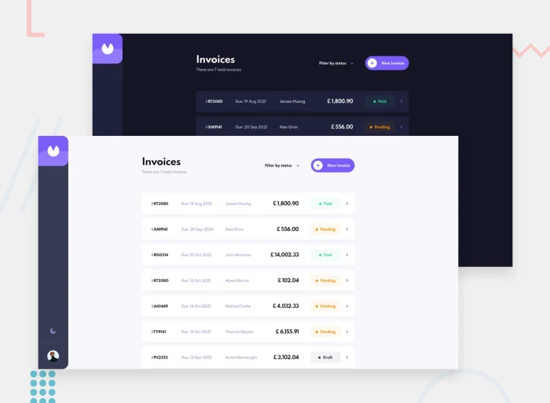
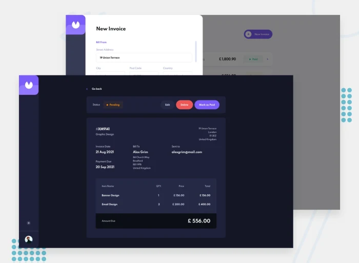

# Invoice Management System - Assessment

This is a solution to the [Invoice Management System challenge](https://github.com/ExquisAppFactory/code-challenge/blob/code-challenge/README.md).

## Table of contents

- [Overview](#overview)
  - [The challenge](#the-challenge)
  - [Screenshot](#screenshot)
  - [Links](#links)
  - [Built with](#built-with)
  - [Useful resources](#useful-resources) -[What I Learned](#what-i-learned)
- [Author](#author)

## Overview

### The challenge

Users should be able to:

- View the optimal layout for the app depending on their device's screen size
- See hover states for all interactive elements on the page
- Create, read, update, and delete invoices
- Receive form validations when trying to create/edit an invoice
- Save draft invoices, and mark pending invoices as paid
- Filter invoices by status (draft/pending/paid)
- Toggle light and dark mode
- Keep track of any changes, even after refreshing the browser (`localStorage` could be used for this if you're building out a full-stack app)

### Screenshot

### Links

- Live Site URL: [link](https://invoice-web-app-react.vercel.app/)

### Built with

- [TailwindCSS](https://tailwindcss.com/) - CSS Framework
- [React](https://reactjs.org/) - JS library
- [React Router](https://reactrouter.com/) - Routing
- [Framer Motion](https://www.framer.com/motion/) - React Animation Library
- [Firebase](https://console.firebase.google.com/) - Firebase Solution

### What I learned

In this project, I learned how to work with libraries like React, Redux Toolkit, Framer Motion, and Moment.js. I also gained experience in building web applications, implementing features like data fetching, form submission, routing, and animations. Additionally, I learned about best practices for structuring and organizing code, as well as working with json files and managing state using Redux Toolkit.

I learned how to work with the Framer Motion library. Prior to this project, I had no experience working with Framer Motion, but through this project, I gained experience in this area.

### Useful resources

- [Framer Motion Documents](https://www.framer.com/motion/introduction/)

## Author

- LinkedIn - [Chidiebere Chukwuma](https://www.linkedin.com/in/chidiebere-chukwuma-bb1708b5/)

### 📝 Project Requirement

Since Covid-19, there has been a surge in online businesses. Business owners need an easy way to send invoice to their customers.
Your starup needs to provide a service that sends invoices to customers. You will be using the microservice architecture to architect
the system, ensuring that services are available at scale.

### User Service

- Integrate third-party authentication for user sign-up and login (e.g., Auth0, Firebase Auth).
- Maintain user profiles with necessary details (e.g., name, email, wallet balance).

### Invoice service

- Accept and store invoice-related details from users.
- Generate a downloadable PDF version of the invoice based on a predefined template.

### Email Service

- Accept invoice details and recipient email.
- Provide an abstraction layer over multiple email service providers. If one fails, it should transparently switch to another.
- Recommended Email Providers: [SendGrid](https://sendgrid.com/docs/API_Reference/Web_API/mail.html), [Mailgun](http://documentation.mailgun.com/quickstart.html#sending-messages), [SparkPost](https://developers.sparkpost.com/), [Amazon SES](http://docs.aws.amazon.com/ses/latest/APIReference/API_SendEmail.html).

### Technical Requirement:

- Use third-party authentication for user handling.
- Each service should be independent. They should be capable of operating separately and be consumed independently.
- Expose well-documented API endpoints for all services.

### Frontend

- Develop a responsive web-based interface.
- Allow users to:
  - Register and log in.
  - Add funds to their wallets.
  - Create, view, and send invoices.
  - Track their wallet's transaction history.
  - View the status of sent emails (e.g., sent, delivered, failed).

## 🚀 Technologies

You can use any of the languange or technology listed below unless otherwise stated:

### Backend

- Java Springboot
- Node.js & Express (javascript & Typescript)
- Python (Any Python stack)

### Database

- MongoDB
- MySQL
- PostGre SQL

### Others

- Docker

### Frontend

- React
- Angular

## **Additional Suggestions:**

- Include logging to track failures or errors in the system.
- Set up CI/CD pipelines using `Github actions`
- Use containerization (e.g., Docker, Docker Compose) for services to ensure a consistent development and deployment environment.
